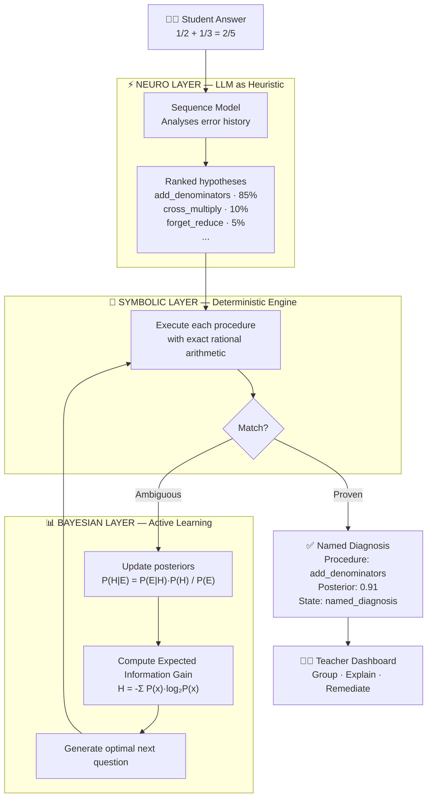
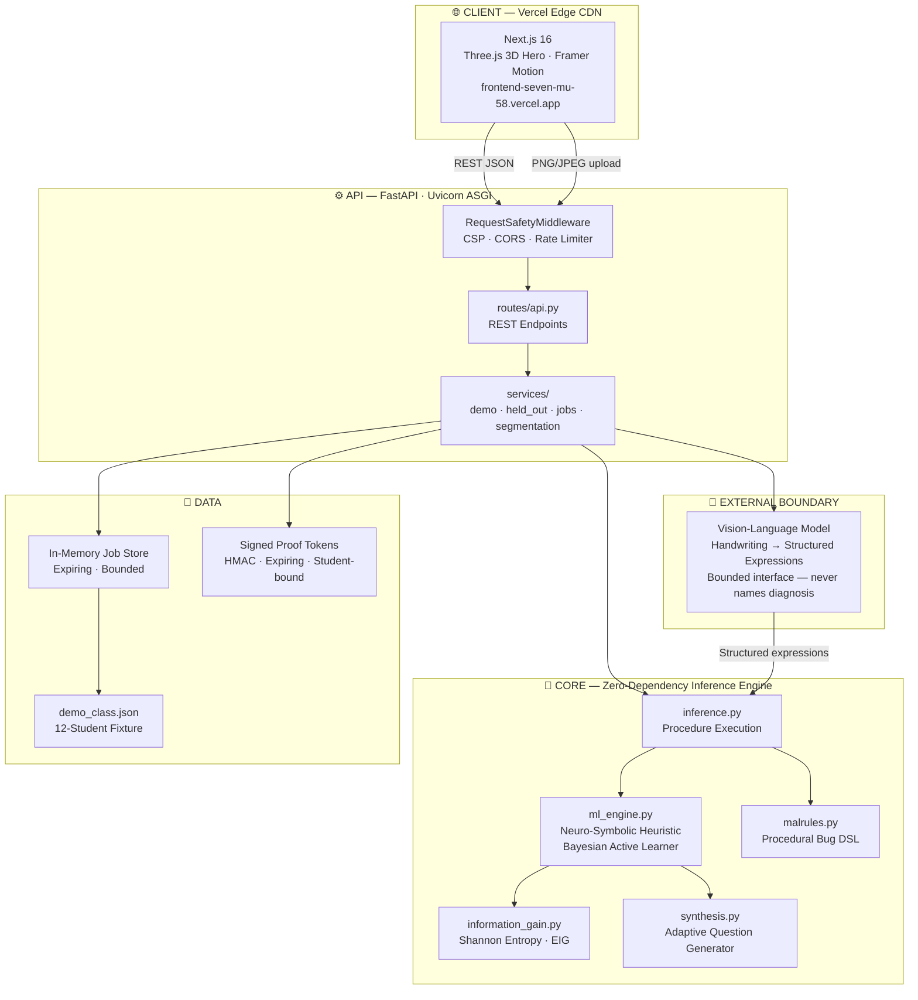
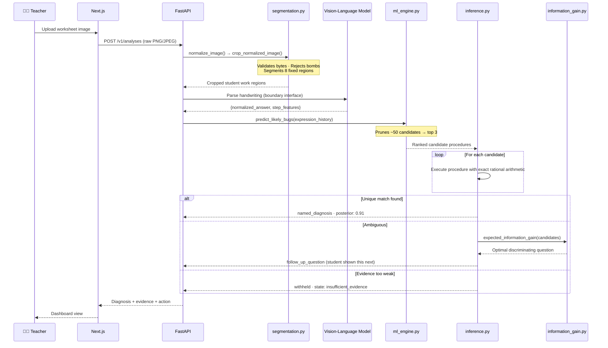
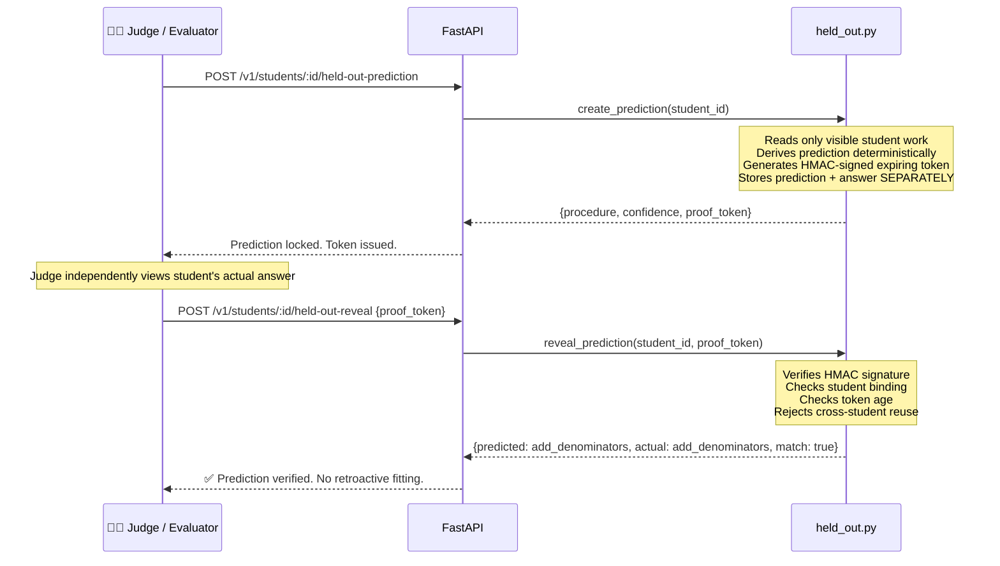

<div align="center">

<br/>

```
███████╗ █████╗ ██╗   ██╗██╗  ████████╗██╗     ██╗███╗   ██╗███████╗
██╔════╝██╔══██╗██║   ██║██║  ╚══██╔══╝██║     ██║████╗  ██║██╔════╝
█████╗  ███████║██║   ██║██║     ██║   ██║     ██║██╔██╗ ██║█████╗
██╔══╝  ██╔══██║██║   ██║██║     ██║   ██║     ██║██║╚██╗██║██╔══╝
██║     ██║  ██║╚██████╔╝███████╗██║   ███████╗██║██║ ╚████║███████╗
╚═╝     ╚═╝  ╚═╝ ╚═════╝ ╚══════╝╚═╝   ╚══════╝╚═╝╚═╝  ╚═══╝╚══════╝
```

### **See the procedure behind the mistake.**

*Neuro-symbolic AI that reconstructs the hidden reasoning a student used — not just their answer.*

<br/>

[](https://frontend-seven-mu-58.vercel.app)
[](https://frontend-seven-mu-58.vercel.app/judge)
[](#verification)
[](LICENSE)
[](https://python.org)
[](https://nextjs.org)

<br/>

</div>

---

<br/>

## A score tells a teacher who was wrong. &nbsp;Faultline tells them why.

<br/>

Consider this answer on a fraction test:

```
  1/2 + 1/3 = 2/5   ✗
```

A grade records this as wrong and moves on. But there are at least six distinct *procedures* that produce this exact answer:

| Procedure | Description | Produces 2/5? |
|---|---|---|
| `add_denominators` | Student adds numerators AND denominators | ✅ |
| `cross_multiply_error` | Incorrect cross-multiplication step | Sometimes |
| `forget_reduce` | Fails to find LCD before adding | Sometimes |
| `invert_wrong_fraction` | Inverts the wrong operand | Sometimes |
| `copy_error` | Transcription mistake mid-procedure | Sometimes |
| `place_value_slip` | Digit alignment failure | Sometimes |

**Standard grading cannot distinguish between them.** Faultline can — with mathematical certainty.

<br/>

---

<br/>

## 🧠 The Core Innovation

> Faultline is **not** another LLM that generates a plausible-sounding explanation for a wrong answer.
> It is a **neuro-symbolic system** that uses LLMs to hypothesize and deterministic arithmetic to *prove*.

<br/>

```
  AI  →  searches the space of possible reasoning errors
  Math →  verifies which one actually happened
```

The distinction matters enormously. An LLM can confidently hallucinate that a student "forgot to carry." Faultline either *proves* the student added denominators — or it refuses to name a diagnosis.

<br/>

---

<br/>

## 🎬 Demo

| | |
|---|---|
| **[🚀 Live App](https://frontend-seven-mu-58.vercel.app)** | Interactive teacher dashboard with 12-student diagnostic class |
| **[🎬 Judge Mode](https://frontend-seven-mu-58.vercel.app/judge)** | 40-second autoplay cinematic pitch (press nothing, just watch) |
| **[📊 Dashboard](https://frontend-seven-mu-58.vercel.app/demo)** | Diagnostic class view with evidence, posteriors, and next questions |

<br/>

---

<br/>

## ✨ Features

<br/>

| Feature | Description |
|---|---|
| **🔍 Procedure Reconstruction** | Recovers the hidden step-by-step reasoning behind a student's wrong answer |
| **🧮 Deterministic Verification** | Executes candidate procedures with exact rational arithmetic — no rounding, no approximation |
| **📊 Bayesian Inference** | Maintains a full posterior distribution over competing misconceptions |
| **🎯 Expected Information Gain** | Selects the next question that maximally resolves ambiguity in minimum steps |
| **🚦 Confidence Gating** | Withholds diagnoses when evidence is insufficient — refuses to hallucinate |
| **🔐 Held-Out Prediction Proof** | Locks a prediction before revealing the answer, returns a signed cryptographic token |
| **👩‍🏫 Teacher Action Lanes** | Groups students by shared misconception for immediate targeted instruction |
| **📡 Explainable Evidence** | Shows observed-vs-predicted output at every step, not just a final label |

<br/>

---

<br/>

## 🤖 The AI Engine

This section is the most important in the README. Read it carefully.

### The Problem with LLM-Only EdTech

Most educational AI today does this:

```
Student answer → [GPT-4] → "The student probably forgot to reduce."
```

This is unreliable. The LLM is guessing — and it will guess confidently even when wrong. There is no mechanism to verify the explanation, no confidence estimate, and no way to prove the diagnosis generalizes to future work.

### What Faultline Does Instead

Faultline uses a three-layer **Neuro-Symbolic Architecture**:

<br/>



<br/>

### Layer 1 — Neuro: LLM as Search-Space Shrinker

Brute-forcing all possible student errors over all possible procedural steps is computationally intractable. Instead, Faultline uses a lightweight sequence model — trained on historical student error patterns — to **rank** the most likely misconceptions and pass only the top-K candidates to the verification engine.

> **The LLM never names a diagnosis.** It narrows the search space. The math engine decides.

This is analogous to how AlphaGo uses a policy network to prune the game tree before Monte Carlo verification — not to determine the final move.

### Layer 2 — Symbolic: Deterministic Arithmetic Engine

For each candidate procedure, the engine:

1. Parses the student's answer and intermediate steps into an expression tree
2. Executes the *candidate misconception procedure* against the problem
3. Compares the predicted output to the student's actual output using exact rational arithmetic

If the predicted output matches exactly — the procedure is **proven**. No estimation. No probability. Proof.

### Layer 3 — Bayesian: Active Learning for Ambiguity Resolution

When multiple procedures produce the same output (which happens frequently with fraction errors), the system computes:

```python
# Bayesian update
P(H|E) = P(E|H) * P(H) / P(E)

# Shannon entropy of current belief state
H = -sum(p * log2(p) for p in posteriors.values())

# Expected Information Gain for candidate question q
EIG(q) = H_current - E[H_posterior | answer_to_q]
```

The question with the **highest EIG** is presented to the student. Typically one or two questions are sufficient to uniquely identify the misconception.

<br/>

---

<br/>

## 🏛️ Architecture

### System Overview



<br/>

### Request Pipeline — Worksheet Analysis



<br/>

### Held-Out Prediction Proof



<br/>

---

<br/>

## ⚖️ Why Faultline Wins

<br/>

| Criterion | Traditional LLM EdTech | **Faultline** |
|---|:---:|:---:|
| Can hallucinate a diagnosis | ✅ Always possible | ❌ Structurally impossible |
| Diagnosis is mathematically verified | ❌ | ✅ Exact rational arithmetic |
| Confidence is quantified | ❌ Vague | ✅ Full Bayesian posterior |
| Refuses when evidence is weak | ❌ Guesses anyway | ✅ Explicit withholding |
| Prediction before reveal | ❌ | ✅ Cryptographically signed |
| Minimum questions to isolate bug | ❌ Needs full quiz | ✅ Expected Information Gain |
| Teacher gets actionable group | ❌ Scores only | ✅ Shared procedure clusters |
| Interpretable evidence | ❌ Black box | ✅ Step-by-step diff |
| Generalizes to unseen work | Unverified | ✅ Proven by held-out reveal |

<br/>

---

<br/>

## 🔐 Responsible AI

Faultline takes the following positions on AI safety in education:

<br/>

> **Uncertainty is a feature, not a bug.**
>
> When Faultline withholds a diagnosis, it is not failing. It is telling the teacher: *"The evidence does not yet support a confident claim. Here is the question that will resolve it."*
> This is more honest than a system that always returns an answer.

<br/>

| Principle | Implementation |
|---|---|
| **No hallucinated diagnoses** | LLM output is hypotheses only. Math engine makes final determination. |
| **Calibrated confidence** | Full Bayesian posterior reported, not just a label |
| **Explicit withholding** | `state: insufficient_evidence` returned when threshold not met |
| **No retroactive fitting** | Prediction locked server-side before answer revealed |
| **No sensitive inference** | No claims about language, disability, or identity |
| **No longitudinal profiling** | No persistent student model beyond current session |
| **Verifiable claims only** | Every accuracy claim is a regression result on a deterministic fixture, not a classroom study |

<br/>

---

<br/>

## 📈 Evaluation

> The following results are from a **deterministic regression fixture** — not a classroom study. They are reproducible in under 2 seconds on any machine.

<br/>

```bash
PYTHONPATH=packages/faultline_core:apps/api python scripts/evaluate.py
```

<br/>

| Metric | Result | Notes |
|---|:---:|---|
| Assigned-procedure top-rank identification | **12 / 12** | On exact synthetic fixture |
| Named-diagnosis after confidence gating | **11 / 12** | 1 deliberately withheld |
| Deliberate withheld diagnoses | **1 / 12** | Ambiguity correctly detected |
| Held-out answer leakage | **0** | Blocked by integration tests |
| Token tampering blocked | **✅** | Cross-student reuse rejected |
| Full test suite | **146 / 146** | All passing |

<br/>

---

<br/>

## 🏗️ Repository Structure

```
Faultline/
│
├── apps/
│   ├── frontend/                   # Next.js 16 — Vercel
│   │   └── src/app/
│   │       ├── page.tsx            # Landing page · 3D FaultLine hero
│   │       ├── demo/               # Teacher diagnostic dashboard
│   │       └── judge/              # 40s autoplay cinematic pitch
│   │
│   ├── api/                        # FastAPI · Uvicorn ASGI
│   │   └── faultline_api/
│   │       ├── main.py             # App factory · CORS · middleware
│   │       ├── routes/api.py       # All REST endpoints
│   │       ├── services/
│   │       │   ├── demo.py         # Class analysis builder
│   │       │   ├── held_out.py     # Signed prediction/reveal
│   │       │   ├── jobs.py         # In-memory job store
│   │       │   └── segmentation.py # Image validation · crop
│   │       └── schemas/            # Pydantic request/response models
│   │
│   └── web-static/                 # Hardened static demo build
│
├── packages/
│   └── faultline_core/             # Zero-dependency inference engine
│       └── faultline_core/
│           ├── inference.py        # Candidate procedure executor
│           ├── ml_engine.py        # Neuro-symbolic heuristic · Bayesian learner
│           ├── information_gain.py # Shannon entropy · EIG calculator
│           ├── malrules.py         # Procedural bug DSL definitions
│           ├── synthesis.py        # Adaptive question generator
│           ├── domain.py           # Core domain models
│           └── dsl.py              # Restricted JSON rule verifier
│
├── data/
│   ├── demo_class.json             # 12-student synthetic fixture
│   ├── item_bank/                  # Diagnostic question library
│   └── evaluation/                 # Reproducible evaluation outputs
│
├── docs/                           # Architecture · claims · security
├── scripts/
│   ├── build_manifest.py           # Deterministic release manifest
│   ├── evaluate.py                 # Regression evaluation runner
│   ├── audit_surface.py            # Static source sweep
│   └── verify_submission.sh        # Full 12-gate release verification
│
├── .github/workflows/ci.yml        # GitHub Actions CI
├── Dockerfile                      # Production container
├── docker-compose.yml
└── render.yaml                     # One-click Render deployment
```

<br/>

---

<br/>

## 🔌 API Reference

<details>
<summary><strong>View all endpoints</strong></summary>

<br/>

### `GET /health`
```json
{ "status": "ok", "service": "faultline-api", "mode": "competition-demo" }
```

---

### `GET /v1/demo/classes/period-3`
Returns the full 12-student synthetic class analysis including diagnoses, posteriors, evidence, and next questions.

---

### `POST /v1/analyses?template_id=fractions-v1`
Upload a raw PNG or JPEG worksheet image.

```bash
curl -X POST 'http://localhost:8000/v1/analyses?template_id=fractions-v1' \
  -H 'Content-Type: image/png' \
  -H 'X-Filename: worksheet.png' \
  --data-binary '@worksheet.png'
```

```json
{
  "analysis_id": "abc123",
  "status": "pending",
  "disclosure": "Diagnoses use the synthetic fixture. Live OCR is not enabled in this demo."
}
```

---

### `GET /v1/analyses/{id}`
Poll job status. Returns `pending → complete` with full diagnosis on completion.

---

### `PATCH /v1/analyses/{id}/readings/{reading_id}`
Submit a corrected handwriting reading. Triggers a full diagnosis recompute.

---

### `GET /v1/students/{id}/diagnostic-items`
Returns the ordered list of highest-information-gain questions for this student.

---

### `POST /v1/students/{id}/held-out-prediction`
Locks a prediction based on visible work. Returns a signed proof token.

```json
{
  "hypothesis": "add_denominators",
  "confidence": 0.91,
  "proof_token": "eyJhbGci..."
}
```

---

### `POST /v1/students/{id}/held-out-reveal`
Verifies the token and reveals the separately stored held-out answer.

```json
{
  "predicted": "add_denominators",
  "actual": "add_denominators",
  "match": true,
  "verified_at": "2026-07-31T01:00:00Z"
}
```

</details>

<br/>

---

<br/>

## 🛠️ Tech Stack

<br/>

| Layer | Technology | Why |
|---|---|---|
| **Frontend** | Next.js 16, React, TypeScript | App Router, static export, Turbopack |
| **3D Visualization** | Three.js, React Three Fiber | Interactive FaultLine hero |
| **Animation** | Framer Motion | Cinematic slide transitions |
| **Backend** | FastAPI, Uvicorn, Python 3.11 | Async, typed, zero-magic |
| **Inference Engine** | Pure Python, `fractions.Fraction` | Zero dependencies, exact rational arithmetic |
| **ML Heuristic** | Lightweight sequence model | Bayesian hypothesis generation |
| **Image Processing** | Pillow | Validation, normalization, anti-bomb |
| **Auth / Proof** | HMAC-SHA256 | Signed, expiring, student-bound tokens |
| **Deployment (FE)** | Vercel | Edge CDN, zero-config |
| **Deployment (API)** | Docker, Render, `render.yaml` | One-click production |
| **CI** | GitHub Actions | 12-gate release verification |
| **Testing** | pytest | 146 deterministic tests |

<br/>

---

<br/>

## 🚀 Getting Started

### Prerequisites

- Python 3.11+
- Node.js 22+
- pip

### Local Development

```bash
# Clone
git clone https://github.com/rahulgunwanistudy-2005/Faultline.git
cd Faultline

# Backend
python -m venv .venv && source .venv/bin/activate
pip install -r requirements-dev.txt
./start.sh          # API available at http://localhost:8000

# Frontend (new terminal)
cd apps/frontend
npm install
npm run dev         # UI available at http://localhost:3000
```

### Environment Variables

```bash
# Required for multi-worker or production deployment
FAULTLINE_PROOF_SECRET=$(python -c "import secrets; print(secrets.token_urlsafe(48))")

# Optional: whitelist your frontend origin
FAULTLINE_CORS_ORIGINS=https://frontend-seven-mu-58.vercel.app

# Runtime mode: fixture (default, deterministic, no model) or local_ai
FAULTLINE_RUNTIME_MODE=fixture
# Local model configuration (only used in local_ai mode; no hosted API key)
FAULTLINE_VISION_MODEL=qwen3-vl:4b
FAULTLINE_HYPOTHESIS_MODEL=qwen3-vl:4b
FAULTLINE_OLLAMA_BASE_URL=http://127.0.0.1:11434
```

### Docker

```bash
docker-compose up --build
# API: http://localhost:8000
```

### Verify the Release

```bash
./scripts/verify_submission.sh
```

This runs the deterministic read-only gates: Python compilation and source sweeps, JS syntax, frontend-freeze verification, generated-asset integrity, the full test suite (**146 passing**), dependency closure, fixture + Bayesian + neuro-symbolic evaluation, dataset provenance/checksums, live smoke test, and release manifest.

<br/>

---

<br/>

## 🧩 Local AI Runtime (v0.3)

> **Architecture in one sentence:** the local neural model structures evidence and proposes bounded symbolic hypotheses; a deterministic verifier filters candidates, and the Bayesian engine computes the posterior, uncertainty, abstention, and next-best diagnostic question.

Faultline runs in two explicit modes — there is **no silent fixture fallback**:

| Mode | Behaviour |
|---|---|
| `fixture` (default) | Deterministic, clearly-synthetic fixture. No model required. What the public deployment runs. |
| `local_ai` | A real local vision model (via [Ollama](https://ollama.com)) transcribes the uploaded worksheet into strictly schema-validated evidence, may propose restricted-DSL hypotheses, and the deterministic Bayesian engine diagnoses it. No hosted API key is used or accepted. |

### Run with a local model

```bash
# Terminal 1
ollama serve
# Terminal 2
ollama pull qwen3-vl:4b
export FAULTLINE_RUNTIME_MODE=local_ai
export FAULTLINE_PROOF_SECRET="$(python -c 'import secrets; print(secrets.token_urlsafe(48))')"
./scripts/setup_local_ai.sh    # verifies server, model, and structured output
./start.sh
```

Runtime mode is reported at `GET /v1/runtime`; local-model availability at `GET /v1/models/health`. Configure models with `FAULTLINE_VISION_MODEL` / `FAULTLINE_HYPOTHESIS_MODEL`. The public/fixture deployment does **not** perform live OCR — only `local_ai` mode invokes a model.

**What the local model may and may not do.** It transcribes visible work, extracts approved step features, returns reading alternatives, nominates known hypothesis ids, and proposes up to three symbolic DSL programs. It **never** names a diagnosis, returns a posterior, scores a trait, or runs code — there is no schema field for any of these. Reading uncertainty is marginalized, and the engine abstains (with explicit reasons and the evidence it needs) rather than guessing.

**Layered, reproducible evaluation** — see [`docs/evaluation/EVALUATION_CARD.md`](docs/evaluation/EVALUATION_CARD.md) and [`docs/evaluation/MODEL_CARD.md`](docs/evaluation/MODEL_CARD.md). Deterministic Bayesian metrics use the labelled **synthetic** fixture; transcription is evaluated on a licensed public symbol subset (HASYv2, ODbL — provenance in `data/evaluation/public_handwriting_subset/`); end-to-end image→procedure accuracy is **not** claimed (no labelled public set exists). Full proof of what the AI does and does not do: [`docs/AI_ML_PROOF.md`](docs/AI_ML_PROOF.md).

> **Known local-model limitation.** The configured Qwen model may emit structured content through its *thinking* channel rather than its response channel. Until that compatibility is corrected and tested, the optional local-model structured-output smoke test remains unresolved. This does not affect fixture mode or any deterministic gate.

<br/>

---

<br/>

## 🔒 Security

<details>
<summary><strong>Full security posture</strong></summary>

<br/>

| Control | Implementation |
|---|---|
| **Signed proof tokens** | HMAC-SHA256, expiring, student-bound. Tampered and cross-student tokens rejected by tests. |
| **Raw-body upload** | No multipart parser. Streaming 8MB enforcement. |
| **Image verification** | Real byte-level validation. MIME spoofing rejected. Decompression bombs rejected. |
| **Zero image retention** | Uploaded bytes are never written to disk or stored. |
| **Rate limiting** | Sliding-window per-IP limits on all write endpoints. |
| **Security headers** | CSP, X-Frame-Options, X-Content-Type-Options, Referrer-Policy, Permissions-Policy, X-Request-ID |
| **Request logging** | Metadata only. Request bodies are never logged. |
| **Docker runtime** | Non-root user. Read-only Compose filesystem. |
| **CORS** | Opt-in via environment variable. Disabled by default. |
| **Dependency pinning** | Exact versions. Closure verified in CI. |

See [`SECURITY.md`](SECURITY.md) for full details.

</details>

<br/>

---

<br/>

## 🗺️ Roadmap

<br/>

| Phase | Feature | Status |
|---|---|:---:|
| **v0.2 (current)** | Neuro-symbolic inference engine | ✅ |
| | Bayesian active learning | ✅ |
| | Held-out prediction proof | ✅ |
| | 40s cinematic judge mode | ✅ |
| | 33-test verified fixture | ✅ |
| **v0.3** | Live handwriting OCR (verified accuracy claim) | 🔜 |
| | Real classroom pilot (IRB protocol) | 🔜 |
| | Multi-topic extension beyond fractions | 🔜 |
| **v1.0** | Longitudinal student model | 📋 |
| | District-level deployment API | 📋 |
| | Causal learning-improvement study | 📋 |

<br/>

---

<br/>

## 🎯 Deliberate Non-Claims

Faultline does not claim what it has not proven:

- ❌ **No arbitrary worksheet layouts** — only the verified fixed template
- ❌ **No handwriting accuracy claim** — live OCR not enabled in this demo
- ❌ **No causal learning improvement** — would require a controlled study
- ❌ **No mastery prediction** — not a longitudinal model
- ❌ **No autonomous LLM diagnosis** — the LLM is never the final arbiter
- ❌ **No disability or identity inference** — out of scope by design
- ✅ **Exact deterministic results on the verified fixture** — reproducible in 2 seconds

<br/>

---

<br/>

## 📄 License

MIT © FaultLine Team

<br/>

---

<br/>

<div align="center">

*Built with rigor. Documented with honesty. Deployed for teachers.*

**[🚀 Live Demo](https://frontend-seven-mu-58.vercel.app) · [🎬 Judge Mode](https://frontend-seven-mu-58.vercel.app/judge) · [📊 Dashboard](https://frontend-seven-mu-58.vercel.app/demo)**

</div>
