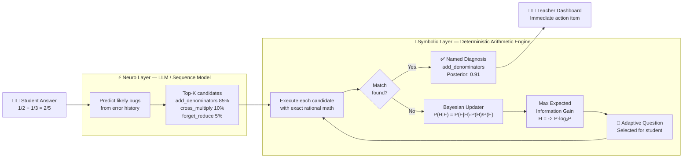
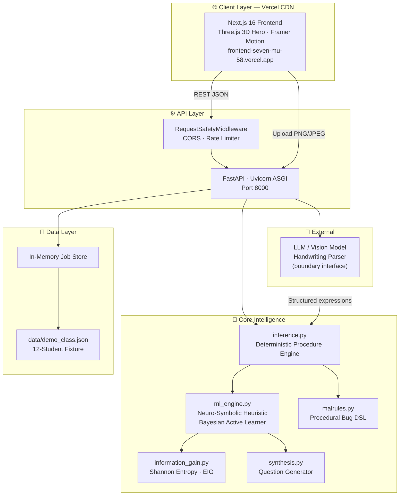
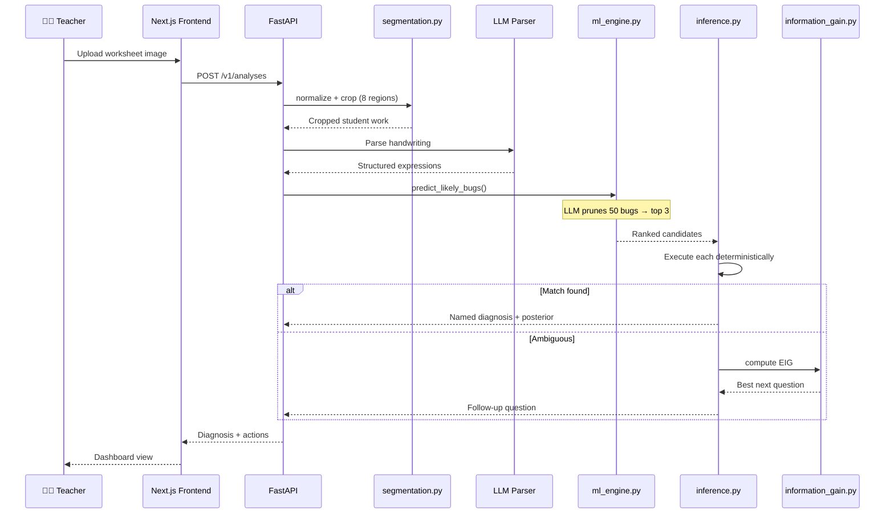
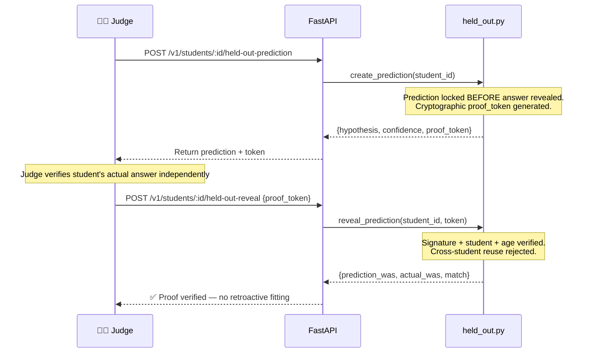
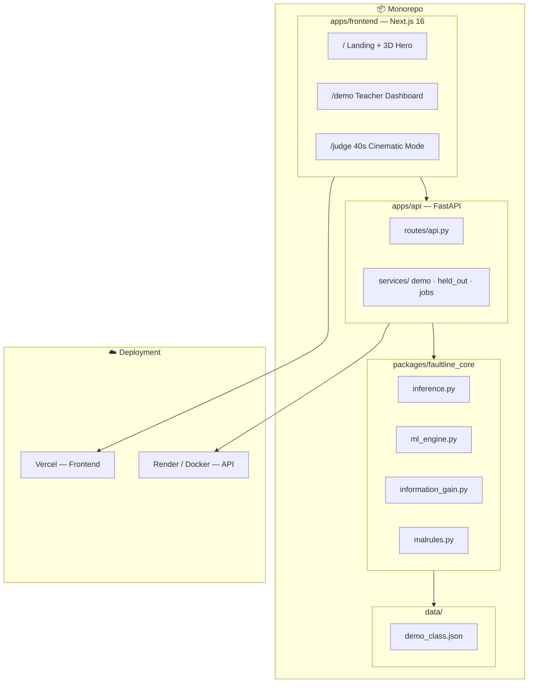

<p align="center">
  
</p>

<h1 align="center">FaultLine</h1>

<p align="center">
  <strong>See the procedure behind the mistake.</strong><br/>
  Neuro-symbolic diagnosis that finds the exact cognitive error a student made — not just a score.
</p>

<p align="center">
  <a href="https://frontend-seven-mu-58.vercel.app"></a>
  <a href="https://frontend-seven-mu-58.vercel.app/judge"></a>
  
  
</p>

---

## The Problem

A failing grade tells a teacher that a student failed. It **never** tells them why.

When a student consistently writes `1/2 + 1/3 = 2/5` — adding the denominators — a standard grading system records a wrong answer and moves on. The underlying procedural defect, *the exact systematic error that will compound across every future math topic*, remains invisible.

**FaultLine surfaces it.**

---

## 🎬 Live Demo

| Link | Description |
|------|-------------|
| **[frontend-seven-mu-58.vercel.app](https://frontend-seven-mu-58.vercel.app)** | Full interactive teacher dashboard |
| **[/judge](https://frontend-seven-mu-58.vercel.app/judge)** | 40-second cinematic pitch (autoplay) |
| **[/demo](https://frontend-seven-mu-58.vercel.app/demo)** | 12-student diagnostic class view |

---

## 🧠 The Core Innovation: Neuro-Symbolic AI

Most EdTech today wraps a generative LLM around a math problem and hopes it doesn't hallucinate. FaultLine takes the opposite approach: a **Neuro-Symbolic Architecture** where Machine Learning and deterministic arithmetic cover each other's weaknesses.

> **Key distinction:** The LLM never names a diagnosis. It strictly acts as a heuristic to shrink the search space. The **deterministic engine** makes the final call. Zero hallucinations by design.

### Neuro-Symbolic Pipeline



---

## ⚙️ How It Works

### 1. Neuro-Symbolic Hypothesis Generation (Search Space Shrinker)
Instead of brute-forcing all ~50 possible procedural bugs, FaultLine uses a lightweight sequence model (trained on historical student error patterns) to rank the top-K most likely bugs. The deterministic arithmetic engine then **proves or disproves** each candidate with exact math.

### 2. Bayesian Active Learning (Exact Expected Information Gain)
When evidence is ambiguous, the system computes a posterior probability distribution across all hypotheses and selects the **exact next question** that maximizes Shannon Entropy reduction:

```
H(X) = -Σ P(x) · log₂(P(x))     ← Current uncertainty
EIG  = H_current - E[H_posterior] ← Expected reduction per question
```

The student answers one targeted question. The bug is isolated. No 20-question quiz required.

### 3. Confidence-Aware Gating (Not Confidently Wrong)
If evidence doesn't reach a confidence threshold, FaultLine **refuses to name a diagnosis**. It explicitly withholds its answer and issues a follow-up question instead. In our fixture: 11/12 named, 1/12 deliberately withheld.

### 4. Held-Out Prediction Proof (Tamper-Proof Fairness)
FaultLine locks a prediction **before** the student's answer is revealed, returns a signed cryptographic proof token, and only reveals the stored answer when that exact token is submitted.

---

## 📊 System Architecture

### Full Stack Overview



---

### Request Flow — Worksheet Analysis



---

### Held-Out Prediction Proof



---

## 🏗️ Repository Structure



---

## 🔌 API Reference

| Method | Route | Description |
|--------|-------|-------------|
| `GET` | `/health` | Health check and runtime mode |
| `GET` | `/v1/demo/classes/period-3` | 12-student synthetic class analysis |
| `POST` | `/v1/analyses?template_id=fractions-v1` | Upload worksheet PNG/JPEG |
| `GET` | `/v1/analyses/{id}` | Poll analysis job status |
| `PATCH` | `/v1/analyses/{id}/readings/{reading_id}` | Correct a reading, recompute |
| `GET` | `/v1/students/{id}/diagnostic-items` | Max-information-gain questions |
| `POST` | `/v1/students/{id}/held-out-prediction` | Lock prediction + issue proof token |
| `POST` | `/v1/students/{id}/held-out-reveal` | Verify token, reveal stored answer |

---

## 📈 Evaluation Results

> These are **regression results** on a deterministic synthetic fixture — not classroom accuracy or learning-impact claims.

| Metric | Result |
|--------|--------|
| Assigned-procedure top-rank identification | **12 / 12** |
| Named-diagnosis after confidence gating | **11 / 12** |
| Deliberate withheld diagnoses | **1 / 12** |
| Held-out answer leakage | **0** (blocked by tests) |
| Token tampering / cross-student reuse | **0** (blocked by tests) |
| Test suite | **33 / 33 passing** |

---

## 🔒 Security

- **Signed, expiring, student-bound proof tokens** — tampered tokens are rejected
- **Raw-body image upload** — no multipart parser dependency
- **Streaming 8MB size enforcement** — decompression bombs rejected
- **Real image byte verification** — MIME spoofing rejected
- **Zero image retention** — uploaded bytes are never stored
- **Sliding-window rate limits** on all write endpoints
- **CSP, anti-framing, MIME-sniffing, referrer, permissions headers**
- **Non-root Docker runtime** with read-only Compose filesystem
- **CORS opt-in only** via environment variable

See [`SECURITY.md`](SECURITY.md) for full details.

---

## 🚀 Run Locally

```bash
# 1. Clone and set up Python environment
git clone https://github.com/rahulgunwanistudy-2005/Faultline.git
cd Faultline
python -m venv .venv && source .venv/bin/activate
pip install -r requirements-dev.txt

# 2. Start the backend API (port 8000)
./start.sh

# 3. Start the frontend (new terminal)
cd apps/frontend
npm install && npm run dev

# 4. Open
# Frontend:   http://localhost:3000
# API:        http://localhost:8000
# Judge Mode: http://localhost:3000/judge
# Health:     http://localhost:8000/health
```

### Environment Variables

```bash
# Required for production / multi-worker deployment
FAULTLINE_PROOF_SECRET=$(python -c "import secrets; print(secrets.token_urlsafe(48))")

# Optional: CORS origins (comma-separated)
FAULTLINE_CORS_ORIGINS=https://your-frontend.vercel.app
```

### Docker

```bash
docker-compose up --build
```

---

## ✅ Verify the Release

```bash
./scripts/verify_submission.sh
```

Checks:
1. Python compilation and categorical source sweeps
2. JavaScript syntax validation
3. Sanitized generated-fixture integrity
4. Core and API test suite (33 tests)
5. Project dependency-closure consistency
6. Reproducible fixture evaluation
7. Live HTTP and signed-proof smoke test
8. Deterministic release-manifest integrity

---

## 🎯 Deliberate Non-Claims

FaultLine is honest about what it is and isn't:

- ❌ No arbitrary worksheet-layout recognition
- ❌ No verified handwriting accuracy claims
- ❌ No causal learning-improvement percentages
- ❌ No mastery forecast or longitudinal learner model
- ❌ No autonomous LLM diagnosis *(LLM guides; math engine decides)*
- ✅ Exact deterministic diagnosis on the verified fixture
- ✅ Confidence-gated — refuses to guess when evidence is weak
- ✅ Cryptographically provable — no retroactive answer fitting

---

## 📄 License

MIT © FaultLine Team
