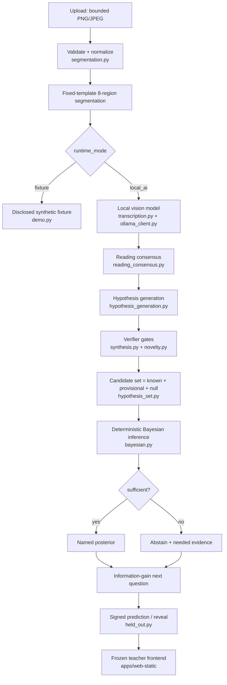

# Neuro-symbolic Bayesian architecture (implemented)

This is the as-built architecture of the v0.3.0 upgrade. See
[neuro_symbolic_bayesian_target.md](neuro_symbolic_bayesian_target.md) for the
design contract and [bayesian_inference.md](bayesian_inference.md) for the math.

## Module map

| Concern | Module |
|---|---|
| Runtime modes + validated config | `apps/api/faultline_api/config.py` |
| Local model client (loopback, bounded, typed errors) | `adapters/ollama_client.py` |
| Model health | `services/model_health.py` |
| Strict model-output schemas | `schemas/model_outputs.py` |
| Vision transcription + preprocessing views | `services/transcription.py` |
| Deterministic reading consensus | `services/reading_consensus.py` |
| Neuro-symbolic hypothesis proposal | `services/hypothesis_generation.py` |
| Verifier + novelty gates | `faultline_core/synthesis.py`, `novelty.py` |
| Priors / likelihood / candidate set | `faultline_core/priors.py`, `likelihood.py`, `hypothesis_set.py` |
| Bayesian engine + info gain | `faultline_core/bayesian.py` |
| Job state machine + pipeline | `services/jobs.py`, `services/background_jobs.py` |
| Single-student analysis (frontend-compatible) | `services/local_analysis.py` |
| Signed held-out proof (demo + upload) | `services/held_out.py` |

## Trust boundary

The neural model **proposes** structured evidence and symbolic hypotheses. The
deterministic engine **executes** them and uses Bayesian inference to **decide**.
The model never assigns the diagnosis, returns the posterior, scores a trait, or
runs code. See [privacy_boundary.md](privacy_boundary.md).
