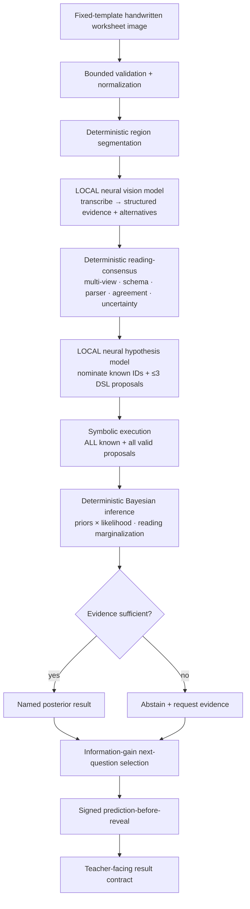

# Target architecture: neuro-symbolic Bayesian diagnosis

This document is the design contract for the v0.3.0 upgrade. It describes the
target pipeline and the trust boundary between the neural and symbolic layers.

## Why this is neuro-symbolic (not "an LLM grader")

Neural perception and neural hypothesis proposal are **constrained to emit
symbolic, executable representations** whose claims are adjudicated by a
deterministic Bayesian + symbolic reasoning layer. The model never decides; it
proposes. The engine executes and infers.

## Trust boundary

| Layer | Owns | Must never |
|---|---|---|
| Neural vision | transcription, intermediate lines, approved step features, reading alternatives, per-token uncertainty | name a diagnosis; return a posterior; infer traits; emit fields outside the schema |
| Neural hypothesis | known-ID nominations, ≤3 DSL program proposals + descriptions | assign the result; return a calibrated probability; write/execute code; use IDs/lookups/conditionals/tools |
| Deterministic executor | run every known + valid proposed procedure with exact `Fraction` arithmetic | trust model output without validation |
| Deterministic Bayesian | priors, likelihoods, marginalization, log-space posterior, entropy, margin, abstention, information gain | copy any model score into the posterior; drop a known hypothesis because the model failed to nominate it |
| Verifier | fit/validation/counterexample/novelty/complexity gates for proposals | silently promote a proposal into the permanent known library |

## Data contracts (summary)

- **Vision output** (`schemas/model_outputs.py: TranscriptionEvidence`):
  `problem_id, visible_expression, final_answer, intermediate_lines[],
  step_features[] (approved vocab only), legibility, uncertain_tokens[]`,
  `extra="forbid"`.
- **Hypothesis output** (`HypothesisProposalBatch`): `known_hypothesis_ids[]`,
  `proposals[]` each `{description, expression}` where `expression` is a restricted
  DSL node (`faultline_core.dsl`). No diagnosis, no probability.
- **Bayesian result** (`faultline_core.bayesian.BayesianResult`): posterior map,
  top hypothesis, top-two margin, entropy, answer/step reproduction, evidence
  count, prior mode + config, abstention reasons.

## Determinism guarantees

Exact rational arithmetic for all math; stable float/decimal log-probabilities only
for aggregation; log-sum-exp normalization; order-invariant and repeatable results
for identical inputs and configuration. Priors and thresholds always appear in
evaluation metadata so results cannot be silently tuned.

## Failure and abstention

Any of: too few usable items, low mean transcription support, high posterior
entropy, small top-two margin, low reproduction, unresolved critical readings, or
no hypothesis explaining enough evidence ⇒ **abstain** with explicit reasons and a
statement of what additional evidence is needed. In `local_ai` mode, an unavailable
model / timeout / malformed output / capability mismatch ⇒ clear recoverable error
or abstention, never a fixture substitution.
