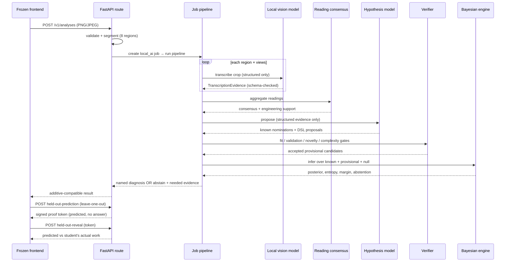

# Neuro-symbolic sequence (local-AI upload)

```mermaid
sequenceDiagram
    participant UI as Frozen frontend
    participant API as FastAPI route
    participant JOB as Job pipeline
    participant VIS as Local vision model
    participant CON as Reading consensus
    participant HYP as Hypothesis model
    participant VER as Verifier
    participant BAY as Bayesian engine

    UI->>API: POST /v1/analyses (PNG/JPEG)
    API->>API: validate + segment (8 regions)
    API->>JOB: create local_ai job → run pipeline
    loop each region × views
        JOB->>VIS: transcribe crop (structured only)
        VIS-->>JOB: TranscriptionEvidence (schema-checked)
    end
    JOB->>CON: aggregate readings
    CON-->>JOB: consensus + engineering support
    JOB->>HYP: propose (structured evidence only)
    HYP-->>JOB: known nominations + DSL proposals
    JOB->>VER: fit / validation / novelty / complexity gates
    VER-->>JOB: accepted provisional candidates
    JOB->>BAY: infer over known + provisional + null
    BAY-->>JOB: posterior, entropy, margin, abstention
    JOB-->>API: named diagnosis OR abstain + needed evidence
    API-->>UI: additive-compatible result

    UI->>API: POST held-out-prediction (leave-one-out)
    API-->>UI: signed proof token (predicted, no answer)
    UI->>API: POST held-out-reveal (token)
    API-->>UI: predicted vs student's actual work
```

The model is on the left of every arrow that *proposes*; the deterministic engine
is on the right of every arrow that *decides*.
