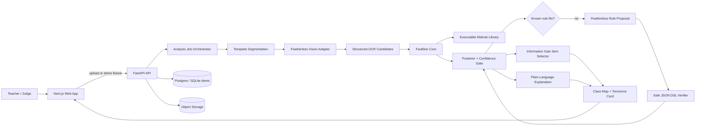

# System Architecture

## Winning architecture

## Architectural principles

1. **Deterministic core:** malrule execution, likelihood scoring, confidence gates, information gain, and verification do not depend on free-form LLM judgment.
2. **Provider adapters:** vision and proposal models sit behind interfaces so the demo can run from fixtures and the provider can be swapped.
3. **Demo reliability:** seeded demo data bypasses external calls while exercising the same result schema and UI components.
4. **Narrow worksheet template:** fixed crop coordinates are acceptable and preferable for a winning prototype; generalized page understanding is a roadmap item.
5. **Separable metrics:** each stage emits its own evaluation result.

## Deployment profiles

### Submission profile

- Next.js on Vercel.
- FastAPI on Railway, Render, Fly.io, or a comparable Python host.
- Postgres/Supabase for job metadata.
- S3-compatible object storage for temporary images.
- In-process async worker or a single background process.

### Production roadmap

- Dedicated queue (Redis/RQ, Celery, or cloud queue).
- Isolated worker for image processing.
- Encrypted object storage and institutional SSO.
- Template authoring and district-level retention controls.

Do not introduce queue infrastructure before the deterministic flow and video are stable.
